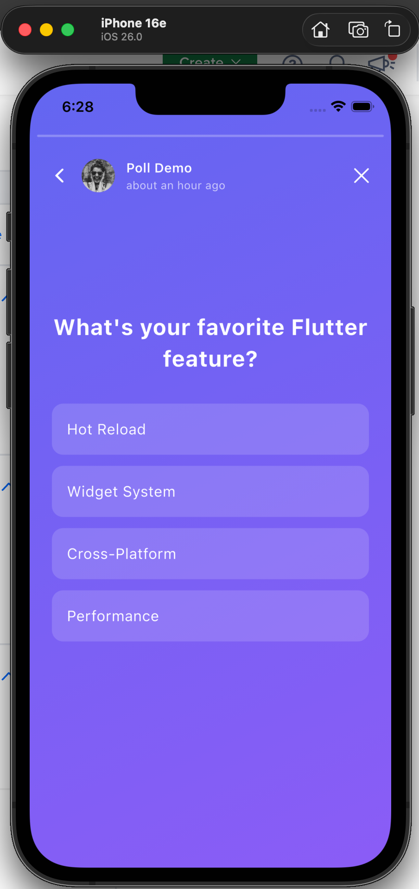
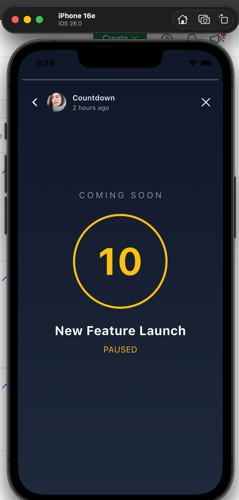
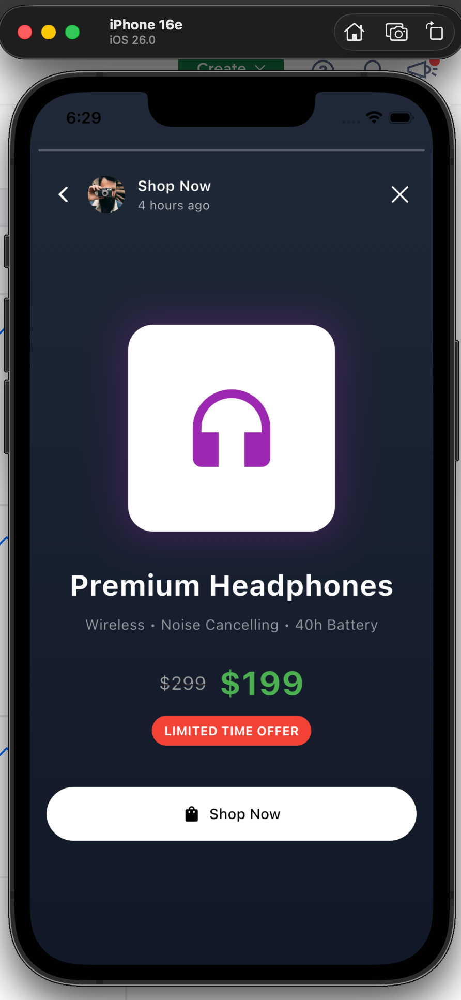
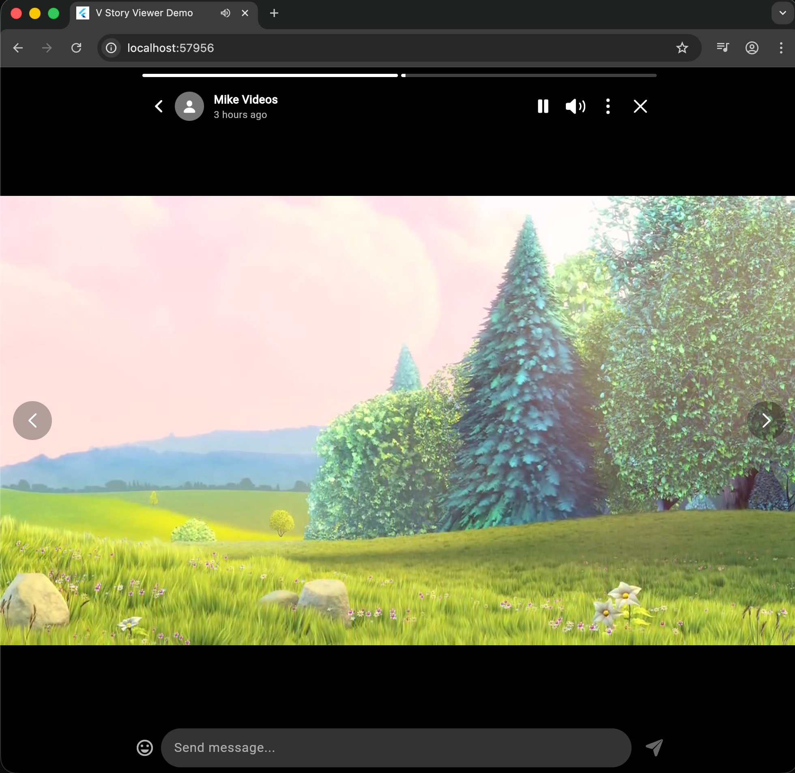

# v_story_viewer

A high-performance Flutter story viewer package inspired by WhatsApp and Instagram stories. Supports images, videos, text, voice, and custom content with beautiful 3D cube transitions.

[](https://pub.dev/packages/v_story_viewer)
[](https://opensource.org/licenses/MIT)

## Showcase

| Story Circle List | Image Story | Video Story |
|:-----------------:|:-----------:|:-----------:|
|  |  |  |

| Text Story | Voice Story | 3D Cube Transition |
|:----------:|:-----------:|:------------------:|
|  |  |  |

## Features

- **Multiple Story Types**: Image, Video, Text, Voice, and fully Custom content
- **3D Cube Transition**: Smooth cube-style page transitions between users
- **Auto-Progress**: Automatic advancement with synced progress bar
- **Gesture Controls**: Tap, long-press, swipe navigation with RTL support
- **Keyboard Support**: Arrow keys, Space, Escape for desktop/web
- **Caching**: Built-in video/audio caching for mobile platforms
- **Preloading**: Automatic preloading of next media content
- **24-Hour Expiry**: Stories automatically expire after 24 hours
- **Full Customization**: Custom headers, footers, progress bars, and content builders
- **Internationalization**: Configurable texts for all UI elements
- **Cross-Platform**: Android, iOS, Web, Windows, Linux, macOS

## Installation

Add to your `pubspec.yaml`:

```yaml
dependencies:
  v_story_viewer: ^2.0.0
```

Then run:

```bash
flutter pub get
```

## Quick Start

### 1. Import the Package

```dart
import 'package:v_story_viewer/v_story_viewer.dart';
```

### 2. Create Story Data

```dart
final storyGroups = [
  VStoryGroup(
    user: VStoryUser(
      id: 'user_1',
      name: 'John Doe',
      imageUrl: 'https://example.com/avatar.jpg',
    ),
    stories: [
      VImageStory(
        url: 'https://example.com/story1.jpg',
        createdAt: DateTime.now(),
        isSeen: false,
      ),
      VVideoStory(
        url: 'https://example.com/story2.mp4',
        createdAt: DateTime.now(),
        isSeen: false,
      ),
    ],
  ),
];
```

### 3. Display Story Circles

```dart
VStoryCircleList(
  storyGroups: storyGroups,
  onUserTap: (group, index) {
    Navigator.push(
      context,
      MaterialPageRoute(
        builder: (_) => VStoryViewer(
          storyGroups: storyGroups,
          initialGroupIndex: index,
          onClose: (_, __) => Navigator.pop(context),
          onComplete: (_, __) => Navigator.pop(context),
        ),
      ),
    );
  },
)
```

## Story Types

### VImageStory

Display static images from URL or local file.

```dart
VImageStory(
  url: 'https://example.com/image.jpg',      // Network URL
  // OR
  filePath: '/path/to/local/image.jpg',      // Local file
  caption: 'Beautiful sunset!',               // Optional caption
  duration: Duration(seconds: 7),             // Default: 5 seconds
  createdAt: DateTime.now(),
  isSeen: false,
  overlayBuilder: (context) => Positioned(    // Optional overlay
    bottom: 100,
    child: Text('Watermark', style: TextStyle(color: Colors.white)),
  ),
)
```

### VVideoStory

Auto-playing video with duration detection.

```dart
VVideoStory(
  url: 'https://example.com/video.mp4',
  // OR
  filePath: '/path/to/local/video.mp4',
  caption: 'Check this out!',
  duration: null,  // null = uses video's actual duration
  createdAt: DateTime.now(),
  isSeen: false,
)
```

**Features:**
- Auto-play when story becomes active
- Auto-pause on navigation, long-press, or app background
- Mute/unmute toggle (web starts muted for autoplay compliance)
- Optional caching on mobile platforms

### VTextStory

Text content with solid background color.

```dart
// Plain text
VTextStory(
  text: 'Hello World!',
  backgroundColor: Colors.purple,
  textStyle: TextStyle(fontSize: 32, fontWeight: FontWeight.bold),
  duration: Duration(seconds: 5),
  createdAt: DateTime.now(),
  isSeen: false,
)

// Rich text with TextSpan
VTextStory(
  text: '',
  richText: TextSpan(
    children: [
      TextSpan(text: 'Hello ', style: TextStyle(color: Colors.white)),
      TextSpan(text: 'World', style: TextStyle(color: Colors.yellow)),
    ],
  ),
  backgroundColor: Colors.blue,
  createdAt: DateTime.now(),
  isSeen: false,
)

// Custom text builder (e.g., for Markdown)
VTextStory(
  text: '# Hello\n**Bold** and *italic*',
  textBuilder: (context, text) => MarkdownBody(data: text),
  backgroundColor: Colors.black,
  createdAt: DateTime.now(),
  isSeen: false,
)
```

### Built-in Text Parsing

Enable automatic text parsing for markdown-style formatting, links, phones, emails, mentions, and hashtags - **no external packages required**:

```dart
VTextStory(
  text: 'Hello **World**! Contact @john at john@email.com or call +1234567890 #flutter',
  enableParsing: true,
  parserConfig: VTextParserConfig(
    // Tap callbacks
    onUrlTap: (url) => launchUrl(Uri.parse(url)),
    onPhoneTap: (phone) => launchUrl(Uri.parse('tel:$phone')),
    onEmailTap: (email) => launchUrl(Uri.parse('mailto:$email')),
    onMentionTap: (mention) => openProfile(mention), // 'john' (without @)
    onHashtagTap: (tag) => searchHashtag(tag),       // 'flutter' (without #)
  ),
  backgroundColor: Colors.purple,
  createdAt: DateTime.now(),
  isSeen: false,
)
```

**Supported Patterns:**

| Pattern | Syntax | Example |
|---------|--------|---------|
| Bold | `**text**` or `__text__` | **bold text** |
| Italic | `*text*` or `_text_` | *italic text* |
| Code | `` `code` `` | `inline code` |
| Link | `[text](url)` | [Click here](https://...) |
| URL | Auto-detected | https://example.com |
| Email | Auto-detected | user@example.com |
| Phone | Auto-detected | +1 (234) 567-8900 |
| Mention | `@username` | @john |
| Hashtag | `#tag` | #flutter |

**Custom Styling:**

```dart
VTextParserConfig(
  boldStyle: TextStyle(fontWeight: FontWeight.w900, color: Colors.yellow),
  italicStyle: TextStyle(fontStyle: FontStyle.italic, color: Colors.cyan),
  codeStyle: TextStyle(fontFamily: 'Courier', backgroundColor: Colors.black45),
  urlStyle: TextStyle(color: Colors.blue, decoration: TextDecoration.underline),
  phoneStyle: TextStyle(color: Colors.green),
  emailStyle: TextStyle(color: Colors.orange),
  mentionStyle: TextStyle(color: Colors.cyan, fontWeight: FontWeight.w600),
  hashtagStyle: TextStyle(color: Colors.pink, fontWeight: FontWeight.w600),
)
```

### VVoiceStory

Audio with visual progress slider.

```dart
VVoiceStory(
  url: 'https://example.com/voice.mp3',
  // OR
  filePath: '/path/to/local/audio.mp3',
  backgroundColor: Colors.indigo,
  caption: 'Voice message',
  duration: null,  // null = uses audio's actual duration
  createdAt: DateTime.now(),
  isSeen: false,
)
```

### VCustomStory

Fully custom content with lifecycle control.

```dart
VCustomStory(
  contentBuilder: (context, isPaused, isMuted, onLoaded, onError) {
    return Lottie.network(
      'https://example.com/animation.json',
      repeat: false,
      animate: !isPaused,
      onLoaded: (composition) {
        onLoaded(composition.duration);  // MUST call when ready
      },
      errorBuilder: (_, __, error) {
        onError(error ?? 'Failed to load');
        return Icon(Icons.error);
      },
    );
  },
  caption: 'Custom animation',
  createdAt: DateTime.now(),
  isSeen: false,
)
```

**Important:** Your `contentBuilder` MUST:
1. Call `onLoaded(duration)` when content is ready (progress bar waits for this)
2. Call `onError(error)` if loading fails
3. Respond to `isPaused` to pause/resume animations
4. Respect `isMuted` for any audio content

## Configuration

### VStoryConfig

Full configuration for the story viewer.

```dart
VStoryViewer(
  storyGroups: groups,
  config: VStoryConfig(
    // Colors
    unseenGradient: [Colors.purple, Colors.pink],
    seenColor: Colors.grey,
    progressColor: Colors.white,
    progressBackgroundColor: Colors.white.withOpacity(0.3),

    // Timing
    defaultDuration: Duration(seconds: 5),
    networkTimeout: 30,
    maxRetries: 5,

    // Caching (mobile only)
    enableCaching: true,
    maxCacheSize: 500 * 1024 * 1024,  // 500MB
    maxCacheAge: Duration(days: 7),
    maxCacheObjects: 100,
    enablePreloading: true,

    // Visibility toggles
    showHeader: true,
    showProgressBar: true,
    showBackButton: true,
    showUserInfo: true,
    showMenuButton: true,
    showCloseButton: true,
    showReplyField: true,
    showEmojiButton: true,
    autoPauseOnBackground: true,
    hideStatusBar: true,

    // Internationalization
    texts: VStoryTexts(
      replyHint: 'Send message...',
      closeLabel: 'Close',
      // ... more texts
    ),
  ),
)
```

### Visibility Flags

| Flag | Default | Description |
|------|---------|-------------|
| `showHeader` | `true` | Show/hide entire header section |
| `showProgressBar` | `true` | Show/hide progress segments |
| `showBackButton` | `true` | Show/hide back arrow |
| `showUserInfo` | `true` | Show/hide avatar + name + time |
| `showMenuButton` | `true` | Show/hide three dots menu |
| `showCloseButton` | `true` | Show/hide X button |
| `showReplyField` | `true` | Show/hide reply input |
| `showEmojiButton` | `true` | Show/hide emoji picker |
| `autoPauseOnBackground` | `true` | Auto-pause when app backgrounds |
| `hideStatusBar` | `true` | Immersive mode (mobile) |

### VStoryCircleConfig

Configuration for story circle appearance.

```dart
VStoryCircleList(
  storyGroups: groups,
  circleConfig: VStoryCircleConfig(
    size: 72,                         // Total circle size
    unseenColor: Color(0xFF4CAF50),   // Green for unseen
    seenColor: Color(0xFF808080),     // Gray for seen
    ringWidth: 3.0,                   // Ring thickness
    ringPadding: 3.0,                 // Gap between ring and avatar
    segmentGap: 0.08,                 // 8% gap between segments
  ),
)
```

### VStoryTexts (Internationalization)

```dart
VStoryTexts(
  replyHint: 'Send message...',
  pauseLabel: 'Pause',
  playLabel: 'Play',
  muteLabel: 'Mute',
  unmuteLabel: 'Unmute',
  closeLabel: 'Close',
  nextLabel: 'Next',
  previousLabel: 'Previous',
  sendLabel: 'Send',
  viewedLabel: 'Viewed',
  errorLoadingMedia: 'Failed to load media',
  tapToRetry: 'Tap to retry',
  backLabel: 'Back',
  menuLabel: 'Menu',
  emojiLabel: 'Emoji',
  keyboardLabel: 'Keyboard',
  noRecentEmojis: 'No recent emojis',
  searchEmoji: 'Search emoji',
)
```

## Custom Builders

Replace any component with your own implementation.

### Custom Header

```dart
VStoryConfig(
  headerBuilder: (context, user, item, onClose) => Row(
    children: [
      CircleAvatar(backgroundImage: NetworkImage(user.imageUrl)),
      SizedBox(width: 8),
      Text(user.name, style: TextStyle(color: Colors.white)),
      Spacer(),
      IconButton(
        icon: Icon(Icons.close, color: Colors.white),
        onPressed: onClose,
      ),
    ],
  ),
)
```

### Custom Footer

```dart
VStoryConfig(
  footerBuilder: (context, group, item) => Padding(
    padding: EdgeInsets.all(16),
    child: Row(
      children: [
        Icon(Icons.favorite_border, color: Colors.white),
        SizedBox(width: 16),
        Icon(Icons.share, color: Colors.white),
      ],
    ),
  ),
)
```

### Custom Progress Bar

```dart
VStoryConfig(
  progressBuilder: (context, count, index, progress) => Row(
    children: List.generate(count, (i) => Expanded(
      child: Padding(
        padding: EdgeInsets.symmetric(horizontal: 2),
        child: LinearProgressIndicator(
          value: i < index ? 1.0 : (i == index ? progress : 0.0),
          backgroundColor: Colors.grey,
          valueColor: AlwaysStoppedAnimation(Colors.white),
        ),
      ),
    )),
  ),
)
```

### Custom Content Builders

```dart
VStoryConfig(
  // Custom image loading
  imageBuilder: (context, story, onLoaded, onError) {
    return CachedNetworkImage(
      imageUrl: story.url!,
      fit: BoxFit.contain,
      imageBuilder: (_, provider) {
        onLoaded();
        return Image(image: provider);
      },
      errorWidget: (_, __, error) {
        onError(error);
        return Icon(Icons.error);
      },
    );
  },

  // Custom video player
  videoBuilder: (context, story, isPaused, isMuted, onLoaded, onError) {
    return BetterPlayer.network(
      story.url!,
      betterPlayerConfiguration: BetterPlayerConfiguration(
        autoPlay: !isPaused,
      ),
    );
  },

  // Custom loading widget
  loadingBuilder: (context) => Center(
    child: SpinKitWave(color: Colors.white),
  ),

  // Custom error widget
  errorBuilder: (context, error, retry) => Column(
    mainAxisSize: MainAxisSize.min,
    children: [
      Icon(Icons.error, color: Colors.red),
      Text('Failed: $error'),
      ElevatedButton(onPressed: retry, child: Text('Retry')),
    ],
  ),
)
```

## Callbacks

### VStoryViewer Callbacks

```dart
VStoryViewer(
  storyGroups: groups,

  // Called when all stories viewed
  onComplete: (group, item) => Navigator.pop(context),

  // Called when close button tapped
  onClose: (group, item) => Navigator.pop(context),

  // Called when story becomes visible (track seen state here)
  onStoryViewed: (group, item) {
    markAsSeen(group.user.id, item);
  },

  // Called on pause (long press, app background)
  onPause: (group, item) => pauseBackgroundMusic(),

  // Called on resume
  onResume: (group, item) => resumeBackgroundMusic(),

  // Called when story skipped via tap
  onSkip: (group, item) => analytics.logSkip(item),

  // Called when reply submitted
  onReply: (group, item, text) {
    sendReply(group.user.id, text);
  },

  // Called on progress updates (~60fps, throttled)
  onProgress: (group, item, progress) {
    print('Progress: ${(progress * 100).toInt()}%');
  },

  // Called when content fails to load
  onError: (group, item, error) {
    logError(error);
  },

  // Called when content loaded
  onLoad: (group, item) {
    preloadNextContent();
  },

  // Called on swipe up gesture
  onSwipeUp: (group, item) {
    openLinkInBrowser();
  },

  // Called when user avatar/name tapped (async, pauses story)
  onUserTap: (group, item) async {
    await Navigator.push(context, UserProfileRoute(group.user));
    return true;  // Return true to resume, false to stay paused
  },

  // Called when menu button tapped (async, pauses story)
  onMenuTap: (group, item) async {
    final action = await showModalBottomSheet(...);
    if (action == 'report') reportStory(item);
    return true;  // Return true to resume
  },
)
```

## Gesture Controls

| Gesture | Action |
|---------|--------|
| Tap left side | Previous story |
| Tap right side | Next story |
| Long press | Pause story |
| Swipe left/right | Navigate between users (3D cube) |
| Swipe down | Close viewer |
| Swipe up | Triggers `onSwipeUp` callback |

## Keyboard Controls (Desktop/Web)

| Key | Action |
|-----|--------|
| Left Arrow | Previous story |
| Right Arrow | Next story |
| Space | Toggle pause/play |
| Escape | Close viewer |

## Story Expiry

Stories automatically expire 24 hours after `createdAt`:

```dart
final story = VImageStory(
  url: 'https://example.com/image.jpg',
  createdAt: DateTime.now().subtract(Duration(hours: 25)),
  isSeen: false,
);

print(story.isExpired);  // true - story is older than 24 hours
```

The viewer automatically filters expired stories. Use `VStoryGroup.validStories` to get non-expired stories.

## Tracking Seen State

The viewer does NOT automatically mark stories as seen. Track it yourself:

```dart
VStoryViewer(
  storyGroups: groups,
  onStoryViewed: (group, item) {
    // Update in your backend/database
    storyService.markAsSeen(
      userId: group.user.id,
      storyId: item.hashCode.toString(),
    );

    // Update local state
    setState(() {
      // Update isSeen in your data model
    });
  },
)
```

## Caching

Video and audio caching is supported on mobile platforms (Android/iOS):

```dart
VStoryConfig(
  enableCaching: true,                    // Enable caching
  maxCacheSize: 500 * 1024 * 1024,        // 500MB max cache size
  maxCacheAge: Duration(days: 7),         // Cache expires after 7 days
  maxCacheObjects: 100,                   // Max 100 cached files
  enablePreloading: true,                 // Preload next video/audio
)
```

**Note:** Web and desktop platforms always stream directly from URL (no caching).

## RTL Support

The viewer automatically adapts to RTL (right-to-left) text direction:

- Tap zones are mirrored (left = next, right = previous)
- Progress bar direction is preserved
- Text alignment follows system settings

## Complete Example

```dart
import 'package:flutter/material.dart';
import 'package:v_story_viewer/v_story_viewer.dart';

class StoryPage extends StatefulWidget {
  @override
  State<StoryPage> createState() => _StoryPageState();
}

class _StoryPageState extends State<StoryPage> {
  late List<VStoryGroup> storyGroups;

  @override
  void initState() {
    super.initState();
    storyGroups = _createStoryData();
  }

  List<VStoryGroup> _createStoryData() {
    return [
      VStoryGroup(
        user: VStoryUser(
          id: 'user_1',
          name: 'Alice',
          imageUrl: 'https://i.pravatar.cc/150?u=alice',
        ),
        stories: [
          VImageStory(
            url: 'https://picsum.photos/1080/1920?random=1',
            caption: 'Beautiful day!',
            createdAt: DateTime.now().subtract(Duration(hours: 2)),
            isSeen: false,
          ),
          VVideoStory(
            url: 'https://sample-videos.com/video321/mp4/720/big_buck_bunny_720p_1mb.mp4',
            caption: 'Fun video',
            createdAt: DateTime.now().subtract(Duration(hours: 1)),
            isSeen: false,
          ),
        ],
      ),
      VStoryGroup(
        user: VStoryUser(
          id: 'user_2',
          name: 'Bob',
          imageUrl: 'https://i.pravatar.cc/150?u=bob',
        ),
        stories: [
          VTextStory(
            text: 'Hello World!',
            backgroundColor: Colors.deepPurple,
            textStyle: TextStyle(fontSize: 48, fontWeight: FontWeight.bold),
            createdAt: DateTime.now(),
            isSeen: false,
          ),
        ],
      ),
    ];
  }

  void _openViewer(int index) {
    Navigator.push(
      context,
      MaterialPageRoute(
        builder: (_) => VStoryViewer(
          storyGroups: storyGroups,
          initialGroupIndex: index,
          config: VStoryConfig(
            showReplyField: true,
            progressColor: Colors.white,
          ),
          onStoryViewed: (group, item) {
            print('Viewed: ${group.user.name}');
          },
          onReply: (group, item, text) {
            print('Reply to ${group.user.name}: $text');
          },
          onComplete: (_, __) => Navigator.pop(context),
          onClose: (_, __) => Navigator.pop(context),
        ),
      ),
    );
  }

  @override
  Widget build(BuildContext context) {
    return Scaffold(
      appBar: AppBar(title: Text('Stories')),
      body: Column(
        children: [
          VStoryCircleList(
            storyGroups: storyGroups,
            showUserName: true,
            circleConfig: VStoryCircleConfig(
              size: 80,
              unseenColor: Colors.green,
              seenColor: Colors.grey,
            ),
            onUserTap: (group, index) => _openViewer(index),
          ),
          // Rest of your content
        ],
      ),
    );
  }
}
```

## Dependencies

- [video_player](https://pub.dev/packages/video_player) - Video playback
- [extended_image](https://pub.dev/packages/extended_image) - Image loading with state callbacks
- [audioplayers](https://pub.dev/packages/audioplayers) - Audio playback
- [timeago](https://pub.dev/packages/timeago) - Relative time formatting
- [emoji_picker_flutter](https://pub.dev/packages/emoji_picker_flutter) - Emoji picker for replies
- [flutter_cache_manager](https://pub.dev/packages/flutter_cache_manager) - Media caching

## Platform Support

| Platform | Support |
|----------|---------|
| Android | Full support |
| iOS | Full support |
| Web | Full support (no caching) |
| Windows | Full support (no caching) |
| Linux | Full support (no caching) |
| macOS | Full support (no caching) |

## License

MIT License - see [LICENSE](LICENSE) for details.

## Author

**Hatem Ragap**
- Email: hatemragapdev@gmail.com
- GitHub: [github.com/hatemragap](https://github.com/hatemragab)

## Contributing

Contributions are welcome! Please feel free to submit a Pull Request.

1. Fork the repository
2. Create your feature branch (`git checkout -b feature/amazing-feature`)
3. Commit your changes (`git commit -m 'Add amazing feature'`)
4. Push to the branch (`git push origin feature/amazing-feature`)
5. Open a Pull Request

## Issues

Found a bug or have a feature request? Please open an issue on the [GitHub repository](https://github.com/v-chat-sdk/v_story_viewer/issues).
