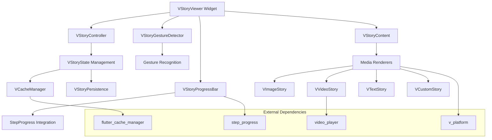
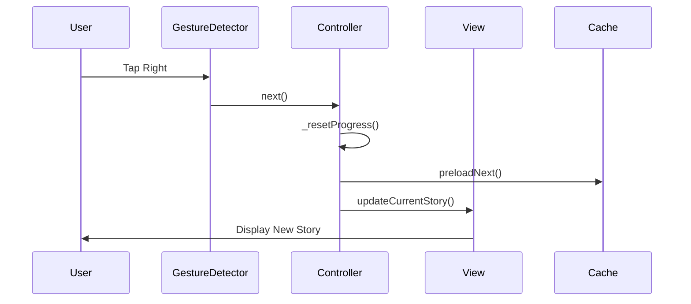
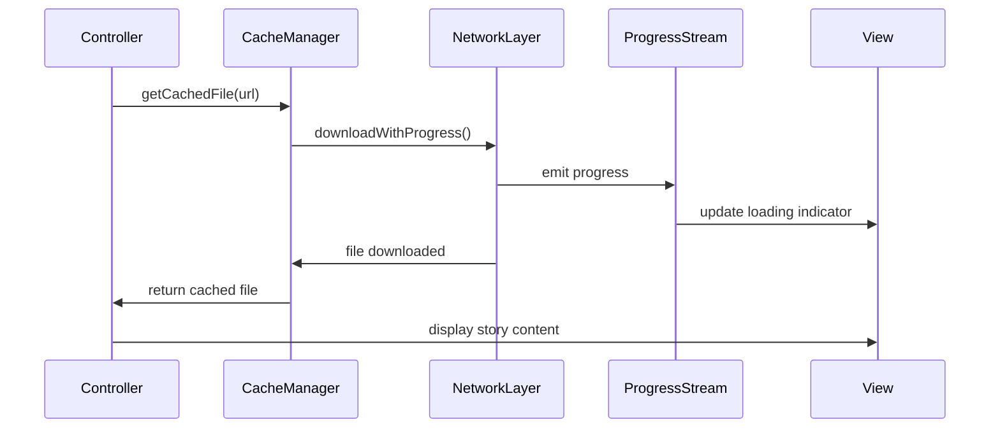
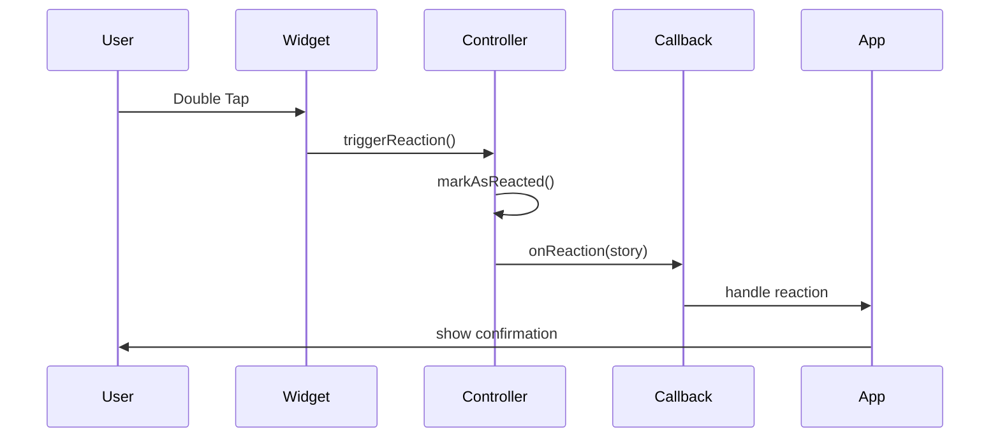

# Design Document

## Overview

The Flutter WhatsApp Story Viewer is architected as a modular, high-performance package that provides WhatsApp-style story viewing functionality. The design emphasizes clean separation of concerns, type safety through sealed classes, and optimal performance through efficient caching and memory management.

## Design Principles & Constraints

### Core Design Principles

1. **Simplicity Over Features**: Keep the API surface minimal and intuitive. Every public method should have a clear, single purpose.

2. **Performance First**: Prioritize 60 FPS animations and memory efficiency over feature richness. No feature should compromise core performance.

3. **Type Safety**: Use sealed classes and discriminated unions to prevent runtime errors. Compile-time safety over runtime flexibility.

4. **ID-Based Navigation**: Never rely on array indexes for navigation. Always use unique story IDs to prevent issues when lists change.

5. **Fail Gracefully**: Every network operation, file access, and user interaction should have a fallback. No crashes, only graceful degradation.

6. **Platform Consistency**: Behavior should be identical across iOS, Android, and web. Use v_platform for unified file handling.


### Non-Negotiable Design Decisions

1. **No Index-Based Navigation**: Story navigation must always use unique IDs, never array positions
2. **Progress Resets**: Story progress always resets to 0 when navigating between stories
3. **Single Love Reaction**: Only one reaction type (love) triggered by double-tap
4. **Pause on Background**: Stories must pause when app goes to background
5. **V-Prefix Naming**: All public classes must use V prefix for namespace consistency

### Design Trade-offs

- **Simplicity vs Flexibility**: Chose simple callback-based architecture over complex stream-based state management
- **Performance vs Features**: Limited animation complexity to maintain 60 FPS performance
- **Type Safety vs Runtime Flexibility**: Used sealed classes which require more boilerplate but prevent runtime errors
- **Memory vs Caching**: Limited video controller cache to 3 instances to prevent memory issues

## User Flow Diagrams

### Complete Story Viewing Journey
```
[App Launch] → [Story List] → [Select User] → [First Unviewed Story]
                    ↓
[Story Loading] → [Story Display] → [Progress Animation]
                    ↓                      ↓
[User Interaction] ← [Story Complete] → [Next Story]
                    ↓                      ↓
[Reply/React] → [Callback Triggered] → [Continue/Exit]
```

### Story Group Navigation Flow
```
[User Stories] → [Check Unviewed] → [Start from First Unviewed]
                        ↓
[Current Story] → [Gesture Input] → [Navigate Left/Right]
                        ↓                    ↓
[Previous Story] ← [Tap Left] | [Tap Right] → [Next Story]
                        ↓                    ↓
[Same User] ← [Within Group] | [Different User] → [New Group]
```

### Error State Flows
```
[Network Request] → [Timeout/Error] → [Show Placeholder]
                         ↓                    ↓
[Retry Policy] → [Exponential Backoff] → [Max Retries]
                         ↓                    ↓
[Success] → [Continue] | [Failure] → [Error Callback]
```

### Reply/Reaction Interaction Flows
```
[Story Display] → [User Input] → [Double Tap] → [Love Reaction]
                       ↓              ↓              ↓
[Focus Reply] → [Pause Story] → [Show Animation] → [Callback]
                       ↓              ↓              ↓
[Keyboard Up] → [Adjust Viewport] → [Resume Story] → [Continue]
```

## State Machine Definitions

### Story Playback State Machine
```
[Initial] → [Loading] → [Playing] → [Completed]
    ↓          ↓           ↓              ↓
[Error] ← [Network Fail] [Paused] → [Next Story]
    ↓          ↑           ↓              ↓
[Retry] → [Loading] ← [User Input] → [Story End]
```

### Story Navigation State Machine
```
[Story List] → [Select Group] → [Find First Unviewed]
                    ↓                    ↓
[Load Story] → [Display Content] → [Track Progress]
                    ↓                    ↓
[User Gesture] → [Navigate] → [Update Current Story]
                    ↓              ↓
[Same Group] | [Different Group] → [Reset Progress]
```

### Cache State Machine
```
[Request URL] → [Check Cache] → [Cache Hit] → [Return File]
                    ↓               ↓
[Cache Miss] → [Download] → [Progress Stream] → [Cache Store]
                    ↓               ↓               ↓
[Network Error] → [Retry] → [Success] → [Return File]
```

### High-Level Architecture



## Component Communication Patterns

### Gesture → Controller → View Flow


### Caching → Loading → Display Pipeline


### Event Propagation Pattern


## Architecture

### Core Architecture Pattern

The package follows a **Controller-View-Model (CVM)** architecture with reactive state management:

```
┌─────────────────┐    ┌──────────────────┐    ┌─────────────────┐
│   VStoryViewer  │◄──►│  VStoryController│◄──►│   VStoryModel   │
│   (View Layer)  │    │ (Control Layer)  │    │  (Data Layer)   │
└─────────────────┘    └──────────────────┘    └─────────────────┘
         │                       │                       │
         ▼                       ▼                       ▼
┌─────────────────┐    ┌──────────────────┐    ┌─────────────────┐
│ Gesture Handler │    │  Progress Manager│    │  Cache Manager  │
│ Progress UI     │    │  Video Controller│    │  File Handler   │
│ Custom Widgets  │    │  State Tracker   │    │  Media Loader   │
└─────────────────┘    └──────────────────┘    └─────────────────┘
```

### Layer Responsibilities

**View Layer (VStoryViewer)**
- Renders story content and UI elements with best flutter practices to follow
- Handles gesture detection and user interactions with best flutter practices to follow
- Manages visual progress indicators come from flutter LinearProgressIndicator class no custom create for it! take care 
- i dont need animations controllers etc... keep all simple as possable with high perfomace 
- Provides customizable header/footer widgets

**Control Layer (VStoryController)**
- Manages story playback state and navigation
- Coordinates between view and data layers
- Handles video controller lifecycle
- Tracks story completion and user interactions
- create its state class in separate file done create more two class in one dart file !
- done create more two class in one dart file !
**Data Layer (VStoryModel)**
- Manages story data and metadata
- Handles caching through flutter_cache_manager
- Provides cross-platform file access via v_platform
- Maintains story state persistence

## Components and Interfaces

### Core Widget Hierarchy

```dart
VStoryViewer
├── VStoryContainer
│   ├── VStoryContent
│   │   ├── VImageStory
│   │   ├── VVideoStory
│   │   ├── VTextStory
│   │   └── VCustomStory
│   ├── VStoryProgressBar
│   ├── VStoryHeader (optional)
│   ├── VStoryFooter (optional)
│   └── VStoryActions
└── VStoryGestureDetector
```

### Data Models

#### Sealed Base Story Class
```dart
enum StoryType { text, image, video, unknown }
sealed class VBaseStory {
  /// Unique identifier for the story
  final String id;

  /// The type of story (text, image, video, unknown)
  final StoryType storyType;

  /// How long this story should be displayed
  final Duration duration;

  /// When this story was viewed by the current user
  final DateTime? viewedAt;

  /// When this story was created
  final DateTime createdAt;

  /// When the user reacted to this story (shows love icon if has value)
  final DateTime? reactedAt;

    /// Additional metadata for the story
  final Map<String, dynamic>? metadata;

    /// Whether this story has been viewed
  bool get isViewed => viewedAt != null;

  /// Whether this story has been reacted to
  bool get isReacted => reactedAt != null;

  /// Alias for createdAt for backward compatibility
  DateTime get timestamp => createdAt;
}
/// Abstract class for stories that contain media (images, videos).
///
/// This class provides a common interface for stories that have media files,
/// allowing type checking to determine if a story is media-based or not.
abstract class VMediaStory extends VBaseStory {
  /// The media file for this story
  VPlatformFile get media;

  const VMediaStory({
    required super.id,
    required super.storyType,
    required super.duration,
    super.viewedAt,
    required super.createdAt,
    super.reactedAt,
    super.viewCount,
    super.metadata,
  });

  /// Whether the media source is from a URL
  bool get isFromUrl => media.networkUrl != null;

  /// Whether the media source is from local path
  bool get isFromPath => media.fileLocalPath != null;

  /// Whether the media source is from assets
  bool get isFromAssets => media.assetsPath != null;
}

class VImageStory extends VMediaStory {
  @override
  final VPlatformFile media;
  final BoxFit fit;
   /// Optional caption for the image
  final String? caption;
  /// Aspect ratio of the image
  final double? aspectRatio;
  /// Image dimensions for aspect ratio calculation
  final Size? dimensions;
 /// Gets the effective aspect ratio (calculated or provided)
  double get effectiveAspectRatio {
    if (aspectRatio != null) return aspectRatio!;
    if (dimensions != null) {
      return dimensions!.width / dimensions!.height;
    }
    return 1.0; // Default square ratio
  }

  /// Whether the image has caption text
  bool get hasCaption => caption != null && caption!.isNotEmpty;

  /// Whether the video source is from a URL
  @override
  bool get isFromUrl => media.networkUrl != null;

  /// Whether the video source is from local path
  @override
  bool get isFromPath => media.fileLocalPath != null;

  /// Whether the video source is from assets
  @override
  bool get isFromAssets => media.assetsPath != null;
}

class VVideoStory extends VMediaStory {
  @override
  final VPlatformFile media;

/// Optional caption for the video
  final String? caption;

  /// Optional thumbnail image for video preview
  final VPlatformFile? thumbnail;

  /// Actual duration of the video content
  final Duration videoDuration;

  /// Video dimensions for aspect ratio calculation
  final Size? dimensions;

  /// Whether the video should start muted
  final bool isMuted;
  
   /// Gets the effective aspect ratio (calculated or default)
  double get effectiveAspectRatio {
    if (dimensions != null) {
      return dimensions!.width / dimensions!.height;
    }
    return 16.0 / 9.0; // Default video ratio
  }
    /// Whether the video has caption text
  bool get hasCaption => caption != null && caption!.isNotEmpty;

  /// Whether the video has a thumbnail
  bool get hasThumbnail => thumbnail != null;

  /// Whether the video source is from a URL
  @override
  bool get isFromUrl => media.networkUrl != null;

  /// Whether the video source is from local path
  @override
  bool get isFromPath => media.fileLocalPath != null;

  /// Whether the video source is from assets
  @override
  bool get isFromAssets => media.assetsPath != null;
}

class VTextStory extends VBaseStory {
  /// Styling configuration for the text story
  final TextStoryStyle textStyle;

  /// Optional background color override
  final Color? backgroundColor;

  /// Optional background gradient override
  final Gradient? backgroundGradient;

  /// Optional background image file/URL
  final VPlatformFile? backgroundImage;

  /// Optional font size override
  final double? fontSize;

  /// Optional font family override
  final String? fontFamily;
  
  const VTextStory({
    Duration duration, // Calculated from text length
  });
}

class VCustomStory extends VBaseStory {
  final Widget Function(BuildContext context) builder;
  
  const VCustomStory({
    required super.id,
    required super.storyType,
    super.duration = const Duration(seconds: 10),
    super.viewedAt,
    required super.createdAt,
    super.reactedAt,
    super.metadata,
    required this.builder,
  });
}
```

#### Configuration Classes
```dart
class VStoryTheme {
  final Color backgroundColor;
  final VStoryProgressStyle progressStyle;
  final VStoryActionStyle actionStyle;
  final VStoryReplyStyle replyStyle;
}

class VStoryProgressStyle {
  final Color activeColor;
  final Color inactiveColor;
  final double height;
  final EdgeInsets padding;
}

class VCachePolicy {
  final Duration maxAge;
  final int maxFiles;
  final int maxSize;
}
```

### Controller Architecture

#### VStoryController
```dart
class VStoryController extends ChangeNotifier with WidgetsBindingObserver {
  // Core state management
  ValueNotifier<VStoryState> _state;
  ValueNotifier<double> _progress; // Resets to 0 when navigating between stories
  
  // Video controller management
  Map<String, VideoPlayerController> _videoControllers;
  
  // Callbacks
  VStoryCallback? onStoryViewed;
  
  // Navigation methods
  Future<void> next();
  Future<void> previous();
  Future<void> goToStory(String storyId);
  
  // Playback control
  void play();
  void pause();
  void stop();
  void reset();
  
  // Progress management - resets on story change
  void _resetProgress() {
    _progress.value = 0.0;
  }
  
  void _markStoryAsViewed(VBaseStory story) {
    onStoryViewed?.call(story);
  }
  
  // App lifecycle handling
  @override
  void didChangeAppLifecycleState(AppLifecycleState state) {
    switch (state) {
      case AppLifecycleState.paused:
      case AppLifecycleState.inactive:
        pause();
        break;
      case AppLifecycleState.resumed:
        play();
        break;
      case AppLifecycleState.detached:
        stop();
        break;
    }
  }
  
  // Lifecycle management
  void attach() {
    WidgetsBinding.instance.addObserver(this);
  }
  
  void detach() {
    WidgetsBinding.instance.removeObserver(this);
  }
  
  @override
  void dispose() {
    detach();
    super.dispose();
  }
}
```

### Gesture System

#### VStoryGestureDetector
```dart
class VStoryGestureDetector extends StatelessWidget {
  final Widget child;
  final VGestureConfig config;
  final VStoryController controller;
  
  // Gesture handlers
  void _handleTap(TapUpDetails details);
  void _handleLongPress();
  void _handleDoubleTap();
  void _handleVerticalDrag(DragEndDetails details);
  void _handleHorizontalDrag(DragEndDetails details);
}
```

## Data Models

### Story Data Structure

#### VStoryList
```dart
class VStoryList {
  final List<VStoryGroup> groups;
  final VStoryListConfig config;
  
  // Navigation helpers
  VStoryGroup? getGroupByUserId(String userId);
  List<VBaseStory> getAllStories();
  int getTotalUnviewedCount();
}

class VStoryGroup {
  final VStoryUser user;
  final List<VBaseStory> stories;
  
  // Group-specific methods
  int get unviewedCount => stories.where((story) => !story.isViewed).length;
  bool get hasUnviewed => unviewedCount > 0;
  VBaseStory? get firstUnviewed => stories.firstWhere(
    (story) => !story.isViewed,
    orElse: () => stories.first,
  );
  int get firstUnviewedIndex => stories.indexWhere((story) => !story.isViewed);
}
```

#### VStoryUser
```dart
class VStoryUser {
  final String id;
  final String name;
  final VPlatformFile? avatarFile;
  final Map<String, dynamic> metadata;
}
```

### File Handling Models

#### VPlatformFile 
- use the v_platform: ^2.1.4 for handel the files types 

## Error Handling

### Error Types
```dart
sealed class VStoryError {
  final String message;
  final dynamic originalError;
  
  const VStoryError(this.message, [this.originalError]);
}

class VMediaLoadError extends VStoryError {
  final VPlatformFile file;
  const VMediaLoadError(super.message, this.file, [super.originalError]);
}

class VNetworkError extends VStoryError {
  final String url;
  const VNetworkError(super.message, this.url, [super.originalError]);
}

class VControllerError extends VStoryError {
  const VControllerError(super.message, [super.originalError]);
}
```

### Error Handling Strategy
- **Graceful Degradation**: Show placeholder content when media fails to load
- **Retry Mechanisms**: Automatic retry for network failures with exponential backoff
- **User Feedback**: Clear error messages with actionable retry options
- **Logging**: Comprehensive error logging for debugging

## App Lifecycle Integration

### Background/Foreground Handling
The VStoryController implements WidgetsBindingObserver to handle app lifecycle changes:

- **App Paused/Inactive**: Automatically pause current story
- **App Resumed**: Resume story playback from current position
- **App Detached**: Stop story playback and cleanup resources

### Story Progress Management
- Progress resets to 0 when navigating between stories
- Each story starts from the beginning when viewed
- Story viewed callback triggered when story completes or user navigates away
- No persistent progress tracking per story - fresh start each time

## Performance Optimizations


### Caching Strategy
```dart
class VCacheManager {
  final CacheManager _cacheManager;
  final VCachePolicy policy;
  final StreamController<VDownloadProgress> _downloadProgressController;
  
  // Download progress stream
  Stream<VDownloadProgress> get downloadProgressStream => _downloadProgressController.stream;
  
  // Caching methods
  Future<File> getCachedFile(String url);
  Stream<FileResponse> getFileStream(String url);
  void preloadStories(List<VBaseStory> stories);
   void dispose() {
    _downloadProgressController.close();
  }
  // Download with progress tracking
  Future<File> downloadWithProgress(String url) async {
    final stream = _cacheManager.getFileStream(url);
    await for (final response in stream) {
      if (response is DownloadProgress) {
        _downloadProgressController.add(VDownloadProgress(
          url: url,
          progress: response.progress ?? 0.0,
          totalSize: response.totalSize,
          downloadedSize: response.downloaded,
        ));
      } else if (response is FileInfo) {
        _downloadProgressController.add(VDownloadProgress(
          url: url,
          progress: 1.0,
          totalSize: response.file.lengthSync(),
          downloadedSize: response.file.lengthSync(),
          isComplete: true,
        ));
        return response.file;
      }
    }
    throw Exception('Download failed for URL: $url');
  }
}

class VDownloadProgress {
  final String url;
  final double progress;
  final int? totalSize;
  final int downloadedSize;
  final bool isComplete;
  
  const VDownloadProgress({
    required this.url,
    required this.progress,
    this.totalSize,
    required this.downloadedSize,
    this.isComplete = false,
  });
}
```

### Rendering Optimizations
- **Lazy Loading**: Load story content only when needed
- **Image Optimization**: Automatic image resizing and format optimization
- **Video Preloading**: Smart video preloading for smooth playback
- **Widget Recycling**: Reuse widgets for better performance

## Internationalization Architecture

### Localization Structure
```dart
class VStoryLocalizations {
  final Locale locale;
  
  // Localized strings
  String get reply;
  String get mute;
  String get hide;
  String get report;
  
  // Date formatting
  String formatTimestamp(DateTime dateTime);
  
  // RTL support
  bool get isRTL;
  TextDirection get textDirection;
}
```

### RTL Support Implementation
- **Layout Mirroring**: Automatic layout direction based on locale
- **Text Alignment**: Proper text alignment for RTL languages
- **Icon Positioning**: Mirror icons and UI elements appropriately
- **Gesture Adaptation**: Adapt gesture areas for RTL layouts

## Integration Points

### Flutter Framework Integration
- **Material Design 3**: Full MD3 theming support
- **Cupertino**: iOS-style components when appropriate
- **Accessibility**:  keyboard navigation support
- **Platform Channels**: Native integration where needed

### Package Dependencies
```yaml
dependencies:
  flutter_cache_manager: ^3.4.1
  v_platform: ^2.1.4
  video_player: ^2.10.0
```

### Custom Integration Hooks
```dart
// Callback definitions
typedef VStoryCallback = void Function(VBaseStory story);
typedef VReplyCallback = void Function(String reply, VBaseStory story);
typedef VReactionCallback = void Function(VBaseStory story);
typedef VActionCallback = void Function(VStoryAction action, VBaseStory story);
```

## Missing Components to Add

### Duration Calculation Algorithm
```dart
class VDurationCalculator {
  static const int defaultWordsPerMinute = 200;
  static const Duration minTextDuration = Duration(seconds: 3);
  static const Duration maxTextDuration = Duration(seconds: 15);
  
  /// Calculates duration for text stories based on word count
  static Duration calculateTextDuration(String text, {
    int wordsPerMinute = defaultWordsPerMinute,
    Duration? minDuration,
    Duration? maxDuration,
  }) {
    final wordCount = text.split(RegExp(r'\s+')).length;
    final readingTimeMs = (wordCount / wordsPerMinute * 60 * 1000).round();
    final calculatedDuration = Duration(milliseconds: readingTimeMs);
    
    final min = minDuration ?? minTextDuration;
    final max = maxDuration ?? maxTextDuration;
    
    if (calculatedDuration < min) return min;
    if (calculatedDuration > max) return max;
    return calculatedDuration;
  }
}
```

### Reply System Architecture
```dart
class VReplySystem {
  final VStoryController controller;
  final VReplyCallback? onReply;
  
  bool _isReplyVisible = false;
  bool get isReplyVisible => _isReplyVisible;
  
  void showReplyInput(VBaseStory story) {
    controller.pause(); // Pause story
    _isReplyVisible = true;
  }
  
  void hideReplyInput() {
    controller.play(); // Resume story
    _isReplyVisible = false;
  }
  
  Future<void> sendReply(String text, VBaseStory story) async {
    try {
      // Call callback
      onReply?.call(text, story);
      hideReplyInput();
    } catch (e) {
      // Handle error
      rethrow;
    }
  }
}
```

### Reaction System
```dart
class VReactionSystem {
  final VReactionCallback? onReaction;
  
  void triggerLoveReaction(VBaseStory story) {
    // Show love reaction animation
    _showLoveReactionAnimation();
    
    // Call callback
    onReaction?.call(story);
    
    // Mark story as reacted
    story.markAsReacted();
  }
  
  void _showLoveReactionAnimation() {
    // Animation logic for love reaction (heart)
  }
}
```

### State Management Classes
```dart
// Separate file: v_story_state.dart
enum VStoryPlaybackState { playing, paused, stopped, loading, error }

class VStoryState {
  final VStoryPlaybackState playbackState;
  final VBaseStory? currentStory;
  final double progress;
  final String? error;
  
  const VStoryState({
    required this.playbackState,
    this.currentStory,
    required this.progress,
    this.error,
  });
  
  VStoryState copyWith({
    VStoryPlaybackState? playbackState,
    VBaseStory? currentStory,
    double? progress,
    String? error,
  }) {
    return VStoryState(
      playbackState: playbackState ?? this.playbackState,
      currentStory: currentStory ?? this.currentStory,
      progress: progress ?? this.progress,
      error: error ?? this.error,
    );
  }
}
```

### Memory Management
```dart
class VMemoryManager {
  static const int maxCachedStories = 10;
  static const int maxVideoControllers = 3;
  
  final Map<String, VideoPlayerController> _videoControllers = {};
  final Queue<String> _videoControllerQueue = Queue();
  
  VideoPlayerController? getVideoController(String storyId) {
    return _videoControllers[storyId];
  }
  
  void addVideoController(String storyId, VideoPlayerController controller) {
    if (_videoControllers.length >= maxVideoControllers) {
      final oldestId = _videoControllerQueue.removeFirst();
      _videoControllers[oldestId]?.dispose();
      _videoControllers.remove(oldestId);
    }
    
    _videoControllers[storyId] = controller;
    _videoControllerQueue.add(storyId);
  }
  
  void cleanupVideoControllers() {
    for (final controller in _videoControllers.values) {
      controller.dispose();
    }
    _videoControllers.clear();
    _videoControllerQueue.clear();
  }
}
```

### Keyboard Safe Area Handler
```dart
class VKeyboardHandler {
  static double getKeyboardHeight(BuildContext context) {
    return MediaQuery.of(context).viewInsets.bottom;
  }
  
  static Widget buildKeyboardSafeArea({
    required Widget child,
    required bool isKeyboardVisible,
  }) {
    return AnimatedContainer(
      duration: const Duration(milliseconds: 300),
      curve: Curves.easeInOut,
      transform: Matrix4.translationValues(
        0,
        isKeyboardVisible ? -100 : 0, // Adjust viewport
        0,
      ),
      child: child,
    );
  }
}
```

### File Structure Organization
```
lib/
├── src/
│   ├── models/
│   │   ├── v_base_story.dart
│   │   ├── v_image_story.dart
│   │   ├── v_video_story.dart
│   │   ├── v_text_story.dart
│   │   ├── v_custom_story.dart
│   │   ├── v_story_user.dart
│   │   ├── v_story_group.dart
│   │   └── v_story_list.dart
│   ├── controllers/
│   │   ├── v_story_controller.dart
│   │   ├── v_story_state.dart
│   │   └── v_memory_manager.dart
│   ├── widgets/
│   │   ├── v_story_viewer.dart
│   │   ├── v_story_container.dart
│   │   ├── v_story_content.dart
│   │   ├── v_story_progress_bar.dart
│   │   └── v_story_gesture_detector.dart
│   ├── systems/
│   │   ├── v_reply_system.dart
│   │   ├── v_reaction_system.dart
│   │   └── v_cache_manager.dart
│   ├── utils/
│   │   ├── v_duration_calculator.dart
│   │   ├── v_keyboard_handler.dart
│   │   └── v_error_handler.dart
│   └── themes/
│       ├── v_story_theme.dart
│       └── v_story_localizations.dart
└── v_story_viewer.dart
```

### Retry Policy System
```dart
class VRetryPolicy {
  static const int maxRetries = 3;
  static const Duration initialDelay = Duration(seconds: 1);
  
  Future<T> executeWithRetry<T>(
    Future<T> Function() operation,
  ) async {
    int attempt = 0;
    Duration delay = initialDelay;
    
    while (attempt < maxRetries) {
      try {
        return await operation();
      } catch (e) {
        attempt++;
        if (attempt >= maxRetries) rethrow;
        await Future.delayed(delay);
        delay *= 2; // Exponential backoff
      }
    }
    throw Exception('Max retries exceeded');
  }
}
```

### Thread Safety for Controller
```dart
class VStoryController extends ChangeNotifier with WidgetsBindingObserver {
  bool _isNavigating = false;
  
  Future<void> next() async {
    if (_isNavigating) return; // Prevent concurrent navigation
    _isNavigating = true;
    try {
      // Navigation logic
      _resetProgress();
      // Update current story
      // Trigger callbacks
    } finally {
      _isNavigating = false;
    }
  }
  
  Future<void> previous() async {
    if (_isNavigating) return;
    _isNavigating = true;
    try {
      // Previous navigation logic
    } finally {
      _isNavigating = false;
    }
  }
}
```

### Gesture Detection Zones
```dart
class VGestureZones {
  static const double navigationZoneWidth = 0.3; // 30% of screen width
  
  static bool isInLeftZone(Offset position, Size screenSize) {
    return position.dx < screenSize.width * navigationZoneWidth;
  }
  
  static bool isInRightZone(Offset position, Size screenSize) {
    return position.dx > screenSize.width * (1 - navigationZoneWidth);
  }
  
  static bool isInCenterZone(Offset position, Size screenSize) {
    return !isInLeftZone(position, screenSize) && !isInRightZone(position, screenSize);
  }
}
```

### Story Transition Animations
```dart
enum TransitionType { fade, slide, none }

class VStoryTransitions {
  static Widget buildTransition({
    required Animation<double> animation,
    required Widget child,
    required TransitionType type,
  }) {
    switch (type) {
      case TransitionType.fade:
        return FadeTransition(opacity: animation, child: child);
      case TransitionType.slide:
        return SlideTransition(
          position: Tween<Offset>(
            begin: const Offset(1.0, 0.0),
            end: Offset.zero,
          ).animate(animation),
          child: child,
        );
      case TransitionType.none:
      default:
        return child;
    }
  }
}
```

### Widget Keys for Performance
```dart
class VStoryViewer extends StatefulWidget {
  @override
  Widget build(BuildContext context) {
    return KeyedSubtree(
      key: ValueKey(controller.state.currentStory?.id),
      child: VStoryContent(
        key: ValueKey('story_content_${controller.state.currentStory?.id}'),
        story: controller.state.currentStory,
        controller: controller,
      ),
    );
  }
}
```

### Reply System with Keyboard Handling
```dart
class VReplyInput extends StatefulWidget {
  final VStoryController controller;
  final VBaseStory story;
  final VReplyCallback? onReply;
  
  @override
  Widget build(BuildContext context) {
    return AnimatedPadding(
      padding: EdgeInsets.only(
        bottom: MediaQuery.of(context).viewInsets.bottom,
      ),
      duration: Duration(milliseconds: 300),
      child: Container(
        padding: EdgeInsets.all(16),
        child: Row(
          children: [
            Expanded(
              child: TextFormField(
                onTap: () => controller.pause(),
                onEditingComplete: () => controller.play(),
                decoration: InputDecoration(
                  hintText: 'Reply to story...',
                  border: OutlineInputBorder(),
                ),
              ),
            ),
            IconButton(
              onPressed: () => _sendReply(),
              icon: Icon(Icons.send),
            ),
          ],
        ),
      ),
    );
  }
}
```

#### VStoryProgressBar Implementation
```dart
class VStoryProgressBar extends StatefulWidget {
  final int totalStories;
  final int currentIndex;
  final VStoryProgressStyle style;
  final VStoryController controller;
  
  @override
  State<VStoryProgressBar> createState() => _VStoryProgressBarState();
}

class _VStoryProgressBarState extends State<VStoryProgressBar> {
  late StepProgressController stepProgressController;
  
  @override
  void initState() {
    super.initState();
    stepProgressController = StepProgressController();
    _setupProgressController();
  }
  
  void _setupProgressController() {
    widget.controller.addListener(_onStoryControllerChange);
  }
  
  @override
  Widget build(BuildContext context) {
    return StepProgress(
      totalSteps: widget.totalStories,
      padding: const EdgeInsets.all(10),
      controller: stepProgressController,
      visibilityOptions: StepProgressVisibilityOptions.lineOnly,
      autoStartProgress: widget.style.autoStart,
      onStepChanged: (currentIndex) {
        debugPrint('Current step changed to: $currentIndex');
        // Sync with story controller
        widget.controller._onProgressChanged(currentIndex);
      },
      theme: StepProgressThemeData(
        activeForegroundColor: widget.style.activeColor,
        defaultForegroundColor: widget.style.inactiveColor,
        stepLineSpacing: widget.style.spacing,
        stepLineStyle: StepLineStyle(
          lineThickness: widget.style.thickness,
          animationDuration: widget.style.animationDuration,
          borderRadius: widget.style.borderRadius,
        ),
      ),
    );
  }
}
```


### Cache Invalidation Strategy
```dart
class VCacheInvalidator {
  static Future<void> invalidateStory(String url) async {
    await DefaultCacheManager().removeFile(url);
  }
  
  static Future<void> invalidateExpiredStories() async {
    // Remove stories older than 24 hours
    final expiry = DateTime.now().subtract(Duration(hours: 24));
    final cacheManager = DefaultCacheManager();
    
    // Get all cached files
    final cacheDir = await cacheManager.getTemporaryDirectory();
    if (cacheDir.existsSync()) {
      final files = cacheDir.listSync();
      for (final file in files) {
        if (file is File) {
          final stat = file.statSync();
          if (stat.modified.isBefore(expiry)) {
            await file.delete();
          }
        }
      }
    }
  }
  
  static Future<void> clearAllCache() async {
    await DefaultCacheManager().emptyCache();
  }
}
```

### Enhanced File Structure Organization
```
lib/
├── src/
│   ├── models/
│   │   ├── v_base_story.dart
│   │   ├── v_image_story.dart
│   │   ├── v_video_story.dart
│   │   ├── v_text_story.dart
│   │   ├── v_custom_story.dart
│   │   ├── v_story_user.dart
│   │   ├── v_story_group.dart
│   │   └── v_story_list.dart
│   ├── controllers/
│   │   ├── v_story_controller.dart
│   │   ├── v_story_state.dart
│   │   └── v_memory_manager.dart
│   ├── widgets/
│   │   ├── v_story_viewer.dart
│   │   ├── v_story_container.dart
│   │   ├── v_story_content.dart
│   │   ├── v_story_progress_bar.dart
│   │   ├── v_story_gesture_detector.dart
│   │   └── v_reply_input.dart
│   ├── systems/
│   │   ├── v_reply_system.dart
│   │   ├── v_reaction_system.dart
│   │   ├── v_cache_manager.dart
│   │   └── v_cache_invalidator.dart
│   ├── utils/
│   │   ├── v_duration_calculator.dart
│   │   ├── v_keyboard_handler.dart
│   │   ├── v_error_handler.dart
│   │   ├── v_retry_policy.dart
│   │   ├── v_gesture_zones.dart
│   │   └── v_story_transitions.dart
│   └── themes/
│       ├── v_story_theme.dart
│       └── v_story_localizations.dart
└── v_story_viewer.dart
```

## Missing Design Components

### Complete Data Model Definitions
```dart
class VTextStory extends VBaseStory {
  final String text;
  final TextStoryStyle textStyle;
  final Color? backgroundColor;
  final Gradient? backgroundGradient;
  final VPlatformFile? backgroundImage;
  
  const VTextStory({
    required super.id,
    required super.storyType,
    required super.duration,
    super.viewedAt,
    required super.createdAt,
    super.reactedAt,
    super.metadata,
    required this.text,
    required this.textStyle,
    this.backgroundColor,
    this.backgroundGradient,
    this.backgroundImage,
  });
}

class TextStoryStyle {
  final String? fontFamily;
  final double fontSize;
  final Color textColor;
  final TextAlign textAlign;
  final FontWeight fontWeight;
  
  const TextStoryStyle({
    this.fontFamily,
    this.fontSize = 24.0,
    this.textColor = Colors.white,
    this.textAlign = TextAlign.center,
    this.fontWeight = FontWeight.normal,
  });
}

enum VStoryAction { hide, mute, report, share, save }

class VStoryActionStyle {
  final Color iconColor;
  final double iconSize;
  final Color backgroundColor;
  
  const VStoryActionStyle({
    this.iconColor = Colors.white,
    this.iconSize = 24.0,
    this.backgroundColor = Colors.black54,
  });
}

class VStoryReplyStyle {
  final Color backgroundColor;
  final Color textColor;
  final Color hintColor;
  final double borderRadius;
  
  const VStoryReplyStyle({
    this.backgroundColor = Colors.white,
    this.textColor = Colors.black,
    this.hintColor = Colors.grey,
    this.borderRadius = 25.0,
  });
}

class VGestureConfig {
  final bool enableTapNavigation;
  final bool enableSwipeNavigation;
  final bool enableLongPressToHold;
  final bool enableDoubleTapReaction;
  final Duration longPressDuration;
  
  const VGestureConfig({
    this.enableTapNavigation = true,
    this.enableSwipeNavigation = true,
    this.enableLongPressToHold = true,
    this.enableDoubleTapReaction = true,
    this.longPressDuration = const Duration(milliseconds: 500),
  });
}

class VStoryListConfig {
  final bool autoStartFromUnviewed;
  final bool loopStories;
  final TransitionType transitionType;
  
  const VStoryListConfig({
    this.autoStartFromUnviewed = true,
    this.loopStories = false,
    this.transitionType = TransitionType.slide,
  });
}
```


### Platform-Specific Considerations
```dart
class VPlatformHandler {
  static bool get isWeb => kIsWeb;
  static bool get isIOS => !kIsWeb && Platform.isIOS;
  static bool get isAndroid => !kIsWeb && Platform.isAndroid;
  
  // Platform-specific gesture handling
  static Duration getHapticFeedbackDuration() {
    if (isIOS) return Duration(milliseconds: 50);
    if (isAndroid) return Duration(milliseconds: 100);
    return Duration.zero; // Web doesn't support haptic
  }
  
  // Platform-specific video handling
  static bool supportsVideoPreloading() {
    return !isWeb; // Web has limitations with video preloading
  }
  
  // Platform-specific caching
  static int getMaxCacheSize() {
    if (isWeb) return 10 * 1024 * 1024; // 10MB for web
    return 100 * 1024 * 1024; // 100MB for mobile
  }
}
```

### Performance Monitoring
```dart
class VPerformanceMonitor {
  static int _frameCount = 0;
  static DateTime _lastFrameTime = DateTime.now();
  static double _currentFPS = 60.0;
  
  static void trackFrame() {
    _frameCount++;
    final now = DateTime.now();
    final elapsed = now.difference(_lastFrameTime).inMilliseconds;
    
    if (elapsed >= 1000) {
      _currentFPS = _frameCount * 1000.0 / elapsed;
      _frameCount = 0;
      _lastFrameTime = now;
      
      if (_currentFPS < 55.0) {
        debugPrint('Performance Warning: FPS dropped to $_currentFPS');
      }
    }
  }
  
  static double get currentFPS => _currentFPS;
  
  static void trackMemoryUsage() {
    // Implementation for memory tracking
  }
}
```

### Error Recovery Strategies
```dart
class VErrorRecovery {
  static Widget buildErrorPlaceholder({
    required VStoryError error,
    VoidCallback? onRetry,
  }) {
    return Container(
      color: Colors.black,
      child: Center(
        child: Column(
          mainAxisAlignment: MainAxisAlignment.center,
          children: [
            Icon(Icons.error_outline, color: Colors.white, size: 48),
            SizedBox(height: 16),
            Text(
              'Failed to load story',
              style: TextStyle(color: Colors.white, fontSize: 16),
            ),
            if (onRetry != null) ...[
              SizedBox(height: 16),
              ElevatedButton(
                onPressed: onRetry,
                child: Text('Retry'),
              ),
            ],
          ],
        ),
      ),
    );
  }
  
  static Widget buildLoadingPlaceholder() {
    return Container(
      color: Colors.black,
      child: Center(
        child: CircularProgressIndicator(color: Colors.white),
      ),
    );
  }
}
```

### Complete File Structure with Example App
```
v_story_viewer/
├── lib/
│   ├── src/
│   │   ├── models/
│   │   │   ├── v_base_story.dart
│   │   │   ├── v_image_story.dart
│   │   │   ├── v_video_story.dart
│   │   │   ├── v_text_story.dart
│   │   │   ├── v_custom_story.dart
│   │   │   ├── v_story_user.dart
│   │   │   ├── v_story_group.dart
│   │   │   ├── v_story_list.dart
│   │   │   └── v_story_action.dart
│   │   ├── controllers/
│   │   │   ├── v_story_controller.dart
│   │   │   ├── v_story_state.dart
│   │   │   └── v_memory_manager.dart
│   │   ├── widgets/
│   │   │   ├── v_story_viewer.dart
│   │   │   ├── v_story_container.dart
│   │   │   ├── v_story_content.dart
│   │   │   ├── v_story_progress_bar.dart
│   │   │   ├── v_story_gesture_detector.dart
│   │   │   ├── v_story_actions.dart
│   │   │   └── v_reply_input.dart
│   │   ├── systems/
│   │   │   ├── v_reply_system.dart
│   │   │   ├── v_reaction_system.dart
│   │   │   ├── v_cache_manager.dart
│   │   │   └── v_cache_invalidator.dart
│   │   ├── utils/
│   │   │   ├── v_duration_calculator.dart
│   │   │   ├── v_keyboard_handler.dart
│   │   │   ├── v_error_handler.dart
│   │   │   ├── v_retry_policy.dart
│   │   │   ├── v_gesture_zones.dart
│   │   │   ├── v_story_transitions.dart
│   │   │   ├── v_security_validator.dart
│   │   │   ├── v_platform_handler.dart
│   │   │   ├── v_performance_monitor.dart
│   │   │   └── v_error_recovery.dart
│   │   └── themes/
│   │       ├── v_story_theme.dart
│   │       └── v_story_localizations.dart
│   └── v_story_viewer.dart
├── example/
│   ├── lib/
│   │   ├── main.dart
│   │   ├── story_data.dart
│   │   ├── custom_story_examples.dart
│   │   └── theme_examples.dart
│   ├── assets/
│   │   ├── images/
│   │   └── videos/
│   └── pubspec.yaml
├── test/
│   ├── unit/
│   │   ├── models/
│   │   ├── controllers/
│   │   └── utils/
│   └── widget/
│       └── story_viewer_test.dart
├── README.md
├── CHANGELOG.md
├── LICENSE
└── pubspec.yaml
```

This design provides a robust, scalable foundation for the WhatsApp Story Viewer package while maintaining flexibility for customization and ensuring optimal performance across all supported platforms.